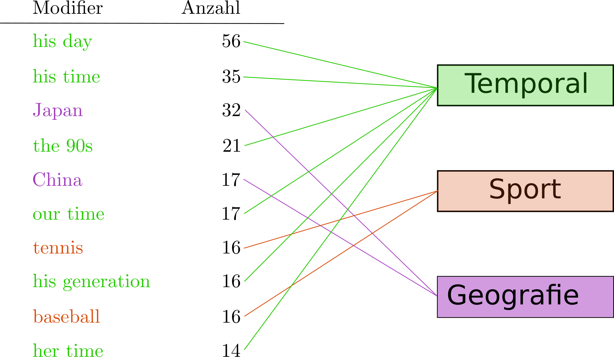

### »Die **Greta Garbo** der **Leichtathletik**« –  Eine systematische Analyse der Modifier vossianischer Antonomasien mithilfe von Word Embeddings

<!-- .element height="200px;" -->

Michel Schwab ¹  · Frank Fischer ² <!-- .element: style="font-size:0.8em;" -->

1 · Humboldt-Universität zu Berlin  
2 · Freie Universität Berlin<!-- .element: style="font-size:0.6em;" -->

 URL dieser Präsentation: **[bit.ly/PLACEHOLDER](https://bit.ly/PLACEHOLDER)** – Illustration: [DALL·E](https://labs.openai.com/s/mjHEyFFSZ6a82FurFVDajUcD)
<!-- .element: style="font-size:0.6em;" -->

[DHd2023](https://www.conftool.net/dhd2023/index.php?page=browseSessions&form_session=189&presentations=show) &nbsp;·&nbsp; Trier &nbsp;🇩🇪 &nbsp;·&nbsp; Fr, 17. März 2023
<!-- .element: style="font-size:0.8em;" -->

---
	  
## Inhalt

 

1. [Defintion und Beispiele](#/1)
2. [Forschungsstand](#/2)
3. [Task](#/3)
4. [Datensatz](#/4)
5. [Methoden](#/5)
6. [Ergebnisse](#/6)

---

# Defintion und Beispiele

--

## Vossianische Antonomasie (Vossanto)

 
	  
- zuerst beschrieben um 1600 von Gerardus Vossius
- besteht aus Target, Source, Modifier (vgl. Bergien 2013)
- traditionelle Beispiele:
  - Vittorio Hösle, "der Boris Becker der Philosophie" (welt.de, 2013)
  - Alice Schwarzer, "der Erich Honecker des Feminismus" (cicero.de, 2014)
  - Markus Lanz, "der Christian Wulff des Showgeschäfts" (spiegel.de, 2014)
  - Jim Koch, "the Steve Jobs of Beer" (The Atlantic, 2014)
- titelgebendes Beispiel:
  - "[Wilson] Kipketer is as guarded [zurückhaltend] as he is fast; some reporters have labeled him the Greta Garbo of track and field.« (NYT, 8. August 1997)"
- Ziel des Projekts: Funktion, Wirkungsweise und Verbreitung der Vossanto in verschiedenen Sprachen auf Basis großer Korpora erforschen

--

## Beispiel

 

<!-- .element width="450px" -->

<small>
image sources: <a href="https://commons.wikimedia.org/wiki">Wikimedia Commons</a></small>

---

# Forschungsstand

 

  

    

    <i class="icon fa fa-home"></i>
    

      <h2>DHd 2017</h2>
      

        Jaeschke et al.
      

    

  

  

    

    <i class="icon fa fa-gift"></i>
    

      <h2>DSH 2019</h2>
      

       Fischer and Jaeschke
      

    

  

  

    

    <i class="icon fa fa-user"></i>
    

      <h2>EMNLP-IJCNLP 2019</h2>
      

        Schwab et al.
      

    

  

  

    

    <i class="icon fa fa-running"></i>
    

      <h2>Frontiers in Artificial Intelligence 2022</h2>
      

      Schwab et al.
      

    

  

  

    

    <i class="icon fa fa-cog"></i>
    

      <h2>ICNLSP 2022</h2>
      

        Schwab et al.
      

    

  

  

    

    <i class="icon fa fa-certificate"></i>
    

      <h2>DHd 2023</h2>
      

      Schwab and Fischer
      

    

  

---

# Task

 

- Bisher: Fokus auf Extraktion von Vossantos oder Analyse der Source
- In diesem Paper: **Exploration und Analyse der Modifier**
- Fragestellungen:
  - In welche Themengebiete werden Attribute verschoben?
  - Welche Modifier/Gebiete dominieren?
  - ...

- Webapp zur Exploration

---

# Datensatz

--

## Vossanto Datensatz (Schwab et. al (2019, 2022))

 

<ol>
  <li>
    regulärer Ausdruck: a/an/the [up to 10 words] of/for/among
    <ul style="list-style-type: none;">
      <li>&#8594; Kandidatensätze </li>
    </ul>
  </li>
  <li>
    Check mit Wikidata Liste bestehend aus Namen und Aliase aller Entitäten mit ‘instance-of’ Eigenschaft 'human'
    <ul style="list-style-type: none;">
      <li>&#8594; Fokus auf Menschen </li>
    </ul>
  </li>
  <li>
     Abgleich mit manuell erstellter Streichliste
    <ul style="list-style-type: none;">
      <li>&#8594;  <s>the House of Commons</s> (vgl. <a href="https://www.wikidata.org/wiki/Q3139666">Homer Doliver House</a>)</li>
    </ul>
  </li>
</ol>

<!-- 1. regulärer Ausdruck: a/an/the [up to 10 words] of/for/among
   -&#8594 Kandidatensätze 
2. Check mit Wikidata Liste bestehend aus Namen und Aliase aller Entitäten mit ‘instance-of’ Eigenschaft 'human'
   - Fokus auf Menschen 
3. Abgleich mit manuell erstellter Streichliste
   - <s>the House of Commons</s> (vgl. [Homer Doliver House](https://www.wikidata.org/wiki/Q3139666)) -->

 <b>Ergebnis</b>: 6095 Sätze, <b>3115</b> davon enthalten Vossanto 

--

## Häufigste Modifier

 

<!-- | Modifier       | Anzahl |
|----------------|--------|
| his day        | 56     |
| his time       | 35     |
| Japan          | 32     |
| the 90s        | 21     |
| China          | 17     |
| our time       | 17     |
| tennis         | 16     |
| his generation | 16     |
| baseball       | 16     |
| her time       | 14     | -->

<!-- .element width="700px" -->

---

# Methoden

--

<!-- ## 1. Embeddings

 

Berechnen kontextabhängiger Word Embeddings, d.h. numerische Repräsentation von Wörtern in Abhängigkeit der Nachbarwörter 

- **S-BERT** (Sentence-Transformer)
  - BERT mit siamesischer Netzwerk-Architektur 
  - Effizientes Berechnen von semantischen Ähnlichkeiten

-- -->

## 1. Embeddings

  

  <ul>
    <li><b>Sentence-BERT</b>		
    <ul>
      <li>BERT mit siamesischer Netzwerk-Architektur</li>
      <li>Effizientes Berechnen von semantischen Ähnlichkeiten</li>
    </ul>
  </ul>
  

  

 
  

--

## 2. Clustering

 

Gruppieren der Embeddings

- **k-means** Algorithmus
  - gruppiert Daten in `k` Cluster
  - Annahme: wenig Ausreißer 
  - feste Anzahl der Cluster bei Berechnung  
  ➜ Vorteil: Durchführung und Analyse mit verschiedenen `k`

--

## 3. Themenzuordnung

 

Zuweisung von Themengebieten je Cluster

- Modifier: kurze Nominalphrasen (1-4 Wörter)
- “klassisches” Topic-Modeling scheitert aufgrund der Kürze der Phrasen
- Stattdessen: WordNet und **WordNet Domains**:
  - Jedes Wort/Synset aus WordNet ist einer oder mehreren Domains zugeordnet (hierarchisch gegliedert)

Beispiel: 
quarterbacks, bull riding, harness track, BMX racing, golf, the Dolphins, … ➜ Sport

<!-- 
--

## 4. Visualisierung

 

Reduktion der hochdimensionalen Vektoren auf 2d, um Daten zu Visualisierung

- PCA (linear)
- t-SNE (non-linear)
- UMAP (non-linear)
- IVIS (non-linear, neural-network based)
- Kombinationen -->

--

## 4. Visualisierung

 

  

  
Reduktion der hochdimensionalen Vektoren auf 2d, um Daten zu Visualisierung

  <ul>
    <li>PCA (linear)</li>
    <li>t-SNE (non-linear)</li>
    <li>UMAP (non-linear)</li>
    <li>IVIS (non-linear, neural-network based)</li>
  </ul>
  

  

 
  

---

# Erkenntnisse und Ausblick

--

## Erkenntnisse

 

- eindeutige Cluster (Kultur, Sport, Geografie)
- Spezieller Cluster: Temporal: Nicht domain-spezifisch
- viele Grenzfälle, z.B. MTV (Musik vs. TV), Irish theaterland (Geo vs. Kultur)
- Cluster splitten sich teilweise logisch aus (Kultur → Musik, Kunst, Literatur, Film/TV)
- [Webapp](https://vossanto.weltliteratur.net/dhd2023/modifier.html)

--

## Ausblick

 

- Sind temporale Vossantos unterschiedlich aufgebaut bzw. sind die Source-Target Paare in derselben Domain?
- Können Modifier und deren Kategorisierung zur Entdeckung von Vossantos beitragen?
- Wie sehen die Verbindungen zwischen Source und Modifier aus?
- …

