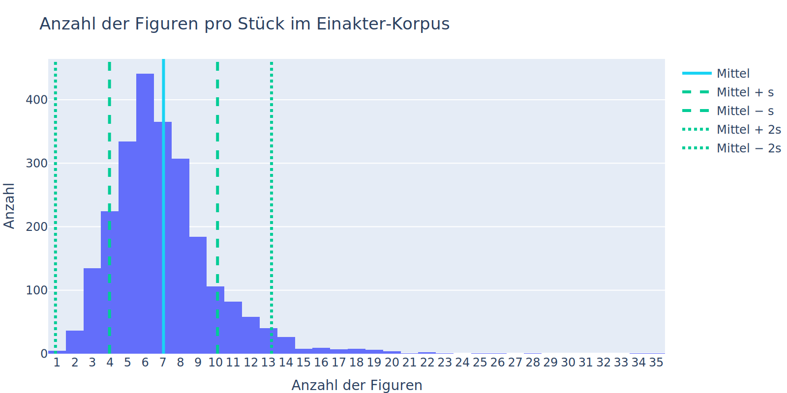

<!-- .slide: class="text-center" -->

<!-- .element: class="r-stretch" -->

<cite class="note">(Tagesschau, [2023](https://www.tagesschau.de/inland/gesellschaft/arbeitszeiten-vollbeschaeftigte-101.html))</cite>

--

## Was ist Statistik?

> Statistik ist die Lehre von Methoden der Gewinnung, Auswertung und Interpretation von Informationen über die Wirklichkeit (Empirie).
> <cite>(Kosfeld et al., 2016)</cite>

--

### Bereiche der Statistik

📊 **Deskriptive Statistik**
<small>Beschreibt Eigenschaften von Daten oder stellt sie grafisch dar</small>

<!-- .element: class="fragment" -->

🔮 **Induktive Statistik** (Inferenzstatistik)
<small>Erlaubt Schlüsse von einer Stichprobe auf die Grundgesamtheit</small>

<!-- .element: class="fragment" -->

<cite class="note">(Diaz-Bone, 2019)</cite>

---

<!-- .slide: class="text-center" -->
<!-- .slide: data-background="black" -->

<!-- Punch cards -->
<!-- .slide: data-background-image="https://media0.giphy.com/media/v1.Y2lkPTc5MGI3NjExY2tvMzV0Yzh5aHA2NTk5c2R2OWs2a3Q0Y2N6YjBibG40dGx5ejJ2biZlcD12MV9pbnRlcm5hbF9naWZfYnlfaWQmY3Q9Zw/l0HlMDr5SOKGpNu5a/giphy.gif" -->

<!-- .slide class="drop-shadow-2xl" -->

## Deskriptive Statistik

_“It’s easy to lie with statistics,   but it’s hard to tell the truth without them.â€_

<cite class="note" style="color: inherit;">Naked Statistics: Stripping the Dread from the Data</cite>

--

### Grundbegriffe

🧍🏻 **Merkmalsträger** (statistische Einheit)
<small>»Träger von Informationen oder Eigenschaften, die im Rahmen einer empirischen Untersuchung interessieren« <cite>(Kosfeld et al., 2016)</cite></small>

<!-- .element: class="fragment" -->

📐 **Merkmal** (Variable)
<small>»Eine (interessierende) Eigenschaft der statistischen Einheiten« <cite>(Kosfeld et al., 2016)</cite></small>
<small>»Eine messbar gemachte [operationalisierte] Dimension (Merkmal), die verschiedene Ausprägungen (Werte) annehmen kann« <cite>(Diaz-Bone, 2019)</cite></small>

<!-- .element: class="fragment" -->

--

### 📶 Skalenniveaus

<!-- |                    | Relation                       | Operatoren          | Beispiele                          | -->
<!-- | :----------------- | :----------------------------- | :------------------ | :--------------------------------- | -->
<!-- | **Nominalskala**   | Identität                      | = ≠                 | Name, PLZ, (Geschlecht)            | -->
<!-- | **Ordinalskala**   | +&nbsp;Rang                    | = ≠ < >             | höchster Bildungsabschluss         | -->
<!-- | **Intervallskala** | +&nbsp;Abstands&shy;gleichheit | = ≠ < > + −     | Temperatur (°C)                    | -->
<!-- | **Ratioskala**     | +&nbsp;natürlicher Nullpunkt   | = ≠ < > + − × ÷ | Temperatur (Kelvin), Einkommen (€) | -->
<!-- | **Absolutskala**   | +&nbsp;natürliche Einheiten    | = ≠ < > + − × ÷ | Anzahl Geschwister                 | -->

<table style="font-size: 0.7em;">
  <thead>
    <tr>
      <th></th>
      <th>Relation</th>
      <th>Operatoren</th>
      <th>Beispiele</th>
    </tr>
  </thead>
  <tbody>
    <tr class="fragment">
      <td><strong>Nominalskala</strong></td>
      <td>Identität</td>
      <td>= ≠</td>
      <td>Name, PLZ, (Geschlecht)</td>
    </tr>
    <tr class="fragment">
      <td><strong>Ordinalskala</strong></td>
      <td>+&nbsp;Rang</td>
      <td>= ≠ &lt; &gt;</td>
      <td>höchster Bildungsabschluss</td>
    </tr>
    <tr class="fragment">
      <td><strong>Intervallskala</strong></td>
      <td>+&nbsp;Abstands&shy;gleichheit</td>
      <td>= ≠ &lt; &gt; + −</td>
      <td>Temperatur (°C)</td>
    </tr>
    <tr class="fragment">
      <td><strong>Ratioskala</strong></td>
      <td>+&nbsp;natürlicher Nullpunkt</td>
      <td>= ≠ &lt; &gt; + − × ÷</td>
      <td>Temperatur (Kelvin), Einkommen (€)</td>
    </tr>
    <tr class="fragment">
      <td><strong>Absolutskala</strong></td>
      <td>+&nbsp;natürliche Einheiten</td>
      <td>= ≠ &lt; &gt; + − × ÷</td>
      <td>Anzahl Geschwister</td>
    </tr>
  </tbody>
</table>

<cite class="note">(vgl. Diaz-Bone, 2019; Kosfeld et al., 2016; Völkl & Korb, 2018)</cite>

---

<!-- Spectrogram -->
<!-- .slide: data-background="black" -->
<!-- .slide: data-background-image="https://media0.giphy.com/media/v1.Y2lkPTc5MGI3NjExenBzZzkyaGhlcTJ0YnN0dHI5emdjbjhjMWhnOTd5NjNtaGxndmxrcyZlcD12MV9pbnRlcm5hbF9naWZfYnlfaWQmY3Q9Zw/m9HyhHFs7oEnZtVMQC/giphy.gif" -->
<!-- .slide: class="text-center" -->

## Univariate Analysen

Grafische Darstellungen und  
statistische Kennwerte

--

<!-- .slide: class="text-center" -->

### 🎭 Einakter-Datensatz

<!-- .element: class="r-stretch" -->

--

### Säulendiagramm

--

<!-- .slide: class="text-center" -->

<cite class="note">(elmundo.es, [2013](https://www.elmundo.es/america/2013/04/15/venezuela/1366029653.html))</cite>

--

### Histogramm

--

### Statistische Kennwerte

_“So we simplify.  
We perform calculations that reduce a complex array of data into a handful of numbers that describe those data”_

<cite class="note" style="color: inherit;">Naked Statistics: Stripping the Dread from the Data</cite>

--

### Kennwerte I: Lagemaße 🎯

**Modus `$\dot{x}$`**
<small>Am häufigsten vorkommender Wert, auch _Modalwert_. Ab Nominalskalierung.</small>

<!-- .element: class="fragment" -->

**Median `$\tilde{x}$`**
<small>Wert, der in einer sortierten Liste in der Mitte liegt. Unempfindlich für Ausreißer. Ab Ordinalskalierung.</small>

<!-- .element: class="fragment" -->

**Arithmetisches Mittel `$\bar{x}$`**
<small>»Durchschnittswert«. Ab Intervallskalierung.</small>

<!-- .element: class="fragment" -->

`$\bar{x} = \frac{\sum_{i=1}^n{x_i}}{n}$`

<!-- .element: class="fragment" -->

--

<!-- .slide: class="text-center" -->

<!-- .element: class="r-stretch" -->

<cite class="note">(<a href="https://commons.wikimedia.org/wiki/File:Visualisation_mode_median_mean.svg">Cmglee</a>, <a href="https://creativecommons.org/licenses/by-sa/3.0">CC BY-SA 3.0</a>, via Wikimedia Commons)</cite>

--

### Kennwerte I: Lagemaße 🎯

| Körpergröße (cm) |
| ---------------- |
| 160              |
| 165              |
| 175              |
| 185              |
| 185              |

<!-- | Kennwert      |        | -->
<!-- | ------------- | ------ | -->
<!-- | `$\dot{x}$`   | 185 cm | -->
<!-- | `$\tilde{x}$` | 175 cm | -->
<!-- | `$\bar{x}$`   | 174 cm | -->

<table>
  <thead>
    <tr>
      <th>Kennwert</th>
      <th></th>
    </tr>
  </thead>
  <tbody>
    <tr>
      <td>$\dot{x}$</td>
      <td class="fragment">185 cm</td>
    </tr>
    <tr>
      <td>$\tilde{x}$</td>
      <td class="fragment">175 cm</td>
    </tr>
    <tr>
      <td>$\bar{x}$</td>
      <td class="fragment">174 cm</td>
    </tr>
  </tbody>
</table>

<!-- .element: class="fragment" -->

--

### Lagemaße

<small class="flex-center">

`$\dot{x} = 6$`

`$\tilde{x} = 7,0$`

`$\bar{x} = 7,04$`

</small>

<!-- Mean: 7.042606516290727, Median: 7.0, Mode: 6 -->

--

### Kennwerte II: Streuungsmaße 🍷

Geben einen Eindruck darüber, wie unterschiedlich die Daten sind.

--

### Kennwerte II: Streuungsmaße 🍷

**Spannweite `$R$`**
<small>Differenz zwischen höchstem und niedrigstem Wert. Anfällig für Ausreißer. Ab Ordinalsaklierung.</small>

<!-- .element: class="fragment" -->

**Varianz `$s^2$`**
<small>Abweichungen vom arithmetischen Mittel. Ab Intervallskalierung. Daten sollten eingipflig sein.</small>
<small>Summe quadratischer Abweichungen (SAQ) durch Anzahl Messwerte (n).</small>

<!-- .element: class="fragment" -->

**Standardabweichung `$s$`**
<small>Wurzel der Varianz. Einfacher inhaltlich zu interpretieren.</small>

<!-- .element: class="fragment" -->

`$s = \sqrt{\frac{\sum_{i=1}^{n}(x_i - \bar{x})^2}{n}}$`

<!-- .element class="fragment" -->

--

### Kennwerte II: Streuungsmaße

| Körpergröße (cm) |
| ---------------- |
| 160              |
| 165              |
| 175              |
| 185              |
| 185              |

<!-- | Kennwert    |       | -->
<!-- | ----------- | ----- | -->
<!-- | `$\bar{x}$` | 174   | -->
<!-- | `$R$`       | 25    | -->
<!-- | `$s^2$`     | 130   | -->
<!-- | `$s$`       | 11,40 | -->

<table class="fragment">
    <thead>
        <tr>
            <th>Kennwert</th>
            <th></th>
        </tr>
    </thead>
    <tbody>
        <tr>
            <td>$\bar{x}$</td>
            <td>174</td>
        </tr>
        <tr>
            <td>$R$</td>
            <td class="fragment">25</td>
        </tr>
        <tr>
            <td>$s^2$</td>
            <td class="fragment">130</td>
        </tr>
        <tr>
            <td>$s$</td>
            <td class="fragment">11,40</td>
        </tr>
    </tbody>
</table>

--

### Histogramm: Streuungsmaße

<!-- Variance: 9.395010081594965, Standard Deviation: 3.0651280693626757 -->

<small class="flex-center">

`$\bar{x} = 7,04$`

`$s^2 = 9,40$`

`$s = 3,06$`

</small>

--

<!-- .slide: class="text-center" -->

### Schiefe von Verteilungen 🎢

<cite class="note">(Völkl & Korb, 2018, S. 122)</cite>

--

<!-- .slide: class="text-center" -->

### Normalverteilung 🔔

<cite class="note">(Völkl & Korb, 2018, S. 117)</cite>

--

<!-- .slide: class="text-center" -->

### Drei-Sigma-Regel

<!-- .element: class="r-stretch" -->

<cite class="note">(<a href="https://commons.wikimedia.org/wiki/File:Empirical_rule_histogram.svg">Melikamp</a>, <a href="https://creativecommons.org/licenses/by-sa/4.0">CC BY-SA 4.0</a>, via Wikimedia Commons)</cite>

--

<!-- .slide: class="text-center" -->

### IQ-Verteilung

 <!-- .element: style="height: 10rem" -->

<small>`$\bar{x} = 100$`  
`$s = 15$`</small>

<cite class="note">(<a href="https://commons.wikimedia.org/wiki/File:IQ_distribution.svg">Dmcq</a>, <a href="https://creativecommons.org/licenses/by-sa/3.0">CC BY-SA 3.0</a>, via Wikimedia Commons)</cite>

---

<!-- .slide: class="text-center" -->
<!-- .slide: data-background="#222" -->

<!-- .element: class="r-stretch" -->

### Exkurs: Befragung <small>(How not to do it)</small>

---

<!-- .slide: class="text-center" -->
<!-- .slide: data-background="black" -->

<!-- Man on mission control -->
<!-- .slide: data-background-image="https://media2.giphy.com/media/v1.Y2lkPTc5MGI3NjExbHU5encyZTYwbXEwbXY0cGNjOWpxM3hoMWhucWF3czBjZHJoZXc5bCZlcD12MV9pbnRlcm5hbF9naWZfYnlfaWQmY3Q9Zw/2463mSK5q2P3qLnoDY/giphy.gif" -->

## Bivariate Analysen

--

<!-- .slide: class="text-center" -->

<cite class="note">(Diaz-Bone, 2019, S. 88)</cite>

--

### Korrelation

<!-- .element class="fragment" -->

<!-- .element class="fragment" -->

--

**Pearson-Korrelationskoeffizient `$r$`**
<small>Beschreibt den ungerichteten Zusammenhang zwischen zwei Variablen</small>

<!-- .element: class="r-stretch" -->

<cite class="note">(Völkl & Korb, 2018, S. 214)</cite>

--

<!-- .slide: class="text-center" -->

 <!-- .element class="drop-shadow-2xl border-1" style="width: 80%" -->

--

<!-- .slide: class="text-center" -->

<!-- .element: class="r-stretch" -->

<cite class="note">(Quinn et al., [1999](https://doi.org/10.1038/20094))</cite>

---

<!-- .slide: class="text-center" -->
<!-- .slide: data-background="white" -->

<!-- Woman on computer -->
<!-- .slide: data-background-image="https://media2.giphy.com/media/v1.Y2lkPTc5MGI3NjExZHQwZXNqZTUxM2dzbGU5YmZyY3hibTNwOGdqN2EyOWxnaHhkbnczdCZlcD12MV9pbnRlcm5hbF9naWZfYnlfaWQmY3Q9Zw/1n8aGJBEXuW0M7ELrB/giphy.gif" -->

<!-- .slide class="drop-shadow-2xl" -->

## Induktive Statistik

--

### Stichprobe und Grundgesamtheit

| Kennwert              | Stichprobe  | Grundgesamtheit |
| :-------------------- | ----------- | --------------- |
| Arithmetisches Mittel | `$\bar{x}$` | `$\mu$`         |
| Varianz               | `$s^2$`     | `$\sigma^2$`    |
| Standardabweichung    | `$s$`       | `$\sigma$`      |
| Fallzahl              | `$n$`       | `$N$`           |

<!-- .element: style="font-size: 0.7em" -->

--

### Lineare Regression: Kennwerte 🔮

<!-- Ziel: Vorhersage des Werts einer abhängigen Variable basierend auf einer unabhängigen Variable -->

**Abhängige Variable** (Y-Achse)
<small>Variable, die durch die unabhängige Variable beeinflusst oder erklärt wird</small>

<!-- .element: class="fragment" -->

**Unabhängige Variable** (X-Achse)
<small>Variable, die verwendet wird, um die Variation in der abhängigen Variable vorherzusagen</small>

<!-- .element: class="fragment" -->

**Bestimmtheitsmaß** `$R^2$`
<small>Durch unabhängige Variable erklärte Varianz der abhängigen Variable. Maß der Anpassungsgüte.</small>

<!-- .element: class="fragment" -->

**Signifikanzwert** `$p$`
<small>Wahrscheinlichkeit, dass die beobachtete Beziehung zwischen den Variablen auf Zufall beruht. Signifikante Ergebnisse ab `$p \leq 0,05$`.</small>

<!-- .element: class="fragment" -->

**Pearson-Korrelationskoeffizient** `$r$`
<small></small>

<!-- .element: class="fragment" -->

<!-- `$\hat{y}_i = b_0 + b_1 \cdot x_i$` -->

<!-- .element: class="fragment" -->

--

### Lineare Regression 🔮

<!-- .element class="fragment" -->

<small class="flex-center fragment">
  $r = 0,59$
  $p = 4,82 \cdot 10^{-48}$   $p < 0,001$ 
  $R^2 = 0,35$
</small>

--

### Lineare Regression 🔮

<!-- .element class="fragment" -->

<small class="flex-center fragment">
  $r = 0,27$
  $p = 6,01 \cdot 10^{-39}$   $p < 0,001$ 
  $R^2 = 0,07$
</small>

--

<!-- .slide: class="text-center" -->

 <!-- .element: style="width:100%" -->

<cite class="note">(<a href="https://commons.wikimedia.org/wiki/File:Correlation_examples2.svg">DenisBoigelot</a>, CC0, via Wikimedia Commons)</cite>

--

<!-- .slide: class="text-center" -->

<video src="https://upload.wikimedia.org/wikipedia/commons/6/66/Regressionsebene_im_dreidimensionalen_Raum.webm" data-autoplay loop ></video>

<!-- .element: class="r-stretch" -->

<cite class="note">(<a href="https://commons.wikimedia.org/wiki/File:Regressionsebene_im_dreidimensionalen_Raum.webm">JonskiC</a>, <a href="https://creativecommons.org/licenses/by-sa/4.0">CC BY-SA 4.0</a>, via Wikimedia Commons)</cite>

---

<!-- .slide: class="text-center" -->

<small>([xkcd: Correlation](https://xkcd.com/552/), [CC BY-NC 2.5](https://creativecommons.org/licenses/by-nc/2.5/))</small>

---

<!-- .slide: class="text-center" -->
<!-- .slide: data-background="black" -->

<!-- Button press -->
<!-- .slide: data-background-image="https://media1.giphy.com/media/v1.Y2lkPTc5MGI3NjExd29jZjU0c3h6aGF2M2J5dXZqOXZpdm5qM2F0MGJubThxMWV6ZjhmOCZlcD12MV9pbnRlcm5hbF9naWZfYnlfaWQmY3Q9Zw/uWA0n6EQy5HxLS6Zni/giphy.gif" -->

<!-- Cassettes -->
<!-- .slide: data-background-image="https://media4.giphy.com/media/v1.Y2lkPTc5MGI3NjExaXZsM3ZsaThvcTQxZ2RmOHE3bHZmemViNjhzdnVoZ2IwendmanpvYyZlcD12MV9pbnRlcm5hbF9naWZfYnlfaWQmY3Q9Zw/3oz8y0fIoBvzUEv88E/giphy.gif" -->

<!-- Buttons -->
<!-- .slide: data-background-image="https://media2.giphy.com/media/v1.Y2lkPTc5MGI3NjExZnAxeDE5ZzVuMjRpbGNkNG9pODF1MGN2NjFtNzlmeHRoMHFkYjVscCZlcD12MV9pbnRlcm5hbF9naWZfYnlfaWQmY3Q9Zw/26ybx720u0sDzbaIU/giphy.gif" -->

<!-- Spectrogram -->
<!-- .slide: data-background-image="https://media0.giphy.com/media/v1.Y2lkPTc5MGI3NjExenBzZzkyaGhlcTJ0YnN0dHI5emdjbjhjMWhnOTd5NjNtaGxndmxrcyZlcD12MV9pbnRlcm5hbF9naWZfYnlfaWQmY3Q9Zw/m9HyhHFs7oEnZtVMQC/giphy.gif" -->

# Fragen

---

#### Weiterführend

--

  
Backhaus, Klaus, Bernd Erichson, Wulff Plinke, und Rolf Weiber. 2018. <i>Multivariate Analysemethoden: Eine anwendungsorientierte Einführung</i>. Berlin, Heidelberg: Springer Berlin Heidelberg. <a href="https://doi.org/10.1007/978-3-662-56655-8">https://doi.org/10.1007/978-3-662-56655-8</a>.

  
  
Diaz-Bone, Rainer. 2019. <i>Statistik für Soziologen</i>. 5., Überarbeitete Auflage. utb basics 2782. München: UVK Verlag.

  
  
Kosfeld, Reinhold, Hans Friedrich Eckey, und Matthias Türck. 2016. â€Gegenstand und Grundbegriffe der Statistik“. In <i>Deskriptive Statistik</i>, von Reinhold Kosfeld, Hans Friedrich Eckey, und Matthias Türck, 1–15. Wiesbaden: Springer Fachmedien Wiesbaden. <a href="https://doi.org/10.1007/978-3-658-13640-6_1">https://doi.org/10.1007/978-3-658-13640-6_1</a>.

  
  
Quinn, Graham E., Chai H. Shin, Maureen G. Maguire, und Richard A. Stone. 1999. â€Myopia and Ambient Lighting at Night“. <i>Nature</i> 399 (6732): 113–14. <a href="https://doi.org/10.1038/20094">https://doi.org/10.1038/20094</a>.

  
  
Völkl, Kerstin, und Christoph Korb. 2018. <i>Deskriptive Statistik</i>. Wiesbaden: Springer Fachmedien Wiesbaden. <a href="https://doi.org/10.1007/978-3-658-10675-1">https://doi.org/10.1007/978-3-658-10675-1</a>.

  

