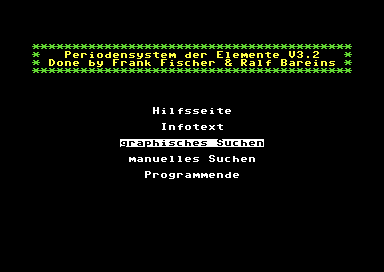
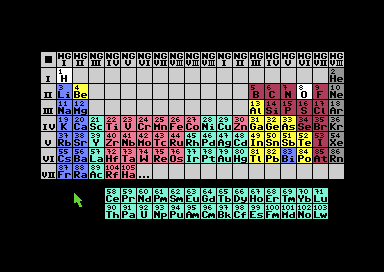
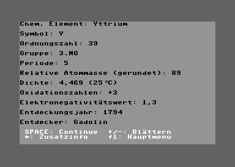

--

<!-- .element width="300px";"; -->
<!-- .element width="300px";"; -->
<!-- .element width="300px";"; -->

Screenshots aus: PSE V3.2. In: Magic Disk 64. Ausgabe 9/1993. Nürnberg: CP Verlag.
<!-- .element: style="font-size:0.65em;" -->

Quelle für die Daten zum Periodensystem: Brockhaus-Enzyklopädie, 19. Auflage.
<!-- .element: style="font-size:0.65em;" -->

--

### ›Literaturgeschichte‹ im Duden

 

- 1. a) Geschichte der Literatur
- 1. b) Literaturwissenschaft
- 2. Werk, das die geschichtliche Darstellung einer Literatur enthält

  

Dudenredaktion (o.&nbsp;J.): ›Literaturgeschichte‹ auf Duden online. URL:  https://www.duden.de/node/90360/revision/1445109 (Abrufdatum: 19.01.2025)
<!-- .element: style="font-size:0.65em;" -->

--
